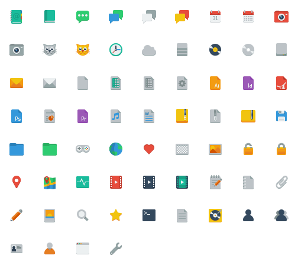

small-n-flat
============

svg icons on a 24px grid
http://paomedia.github.io/small-n-flat/

Another concept
---------------

For CSS, multi-sized / scalable icons : https://codepen.io/paomedia/pen/BVgaRm
Not a project, just an idea (🄯)
